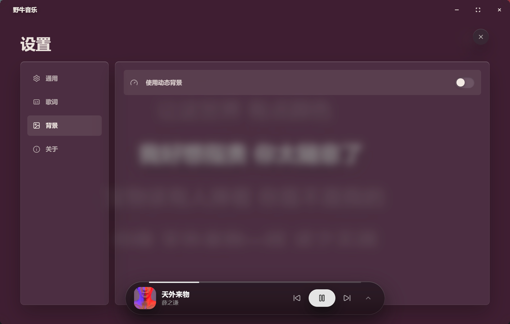
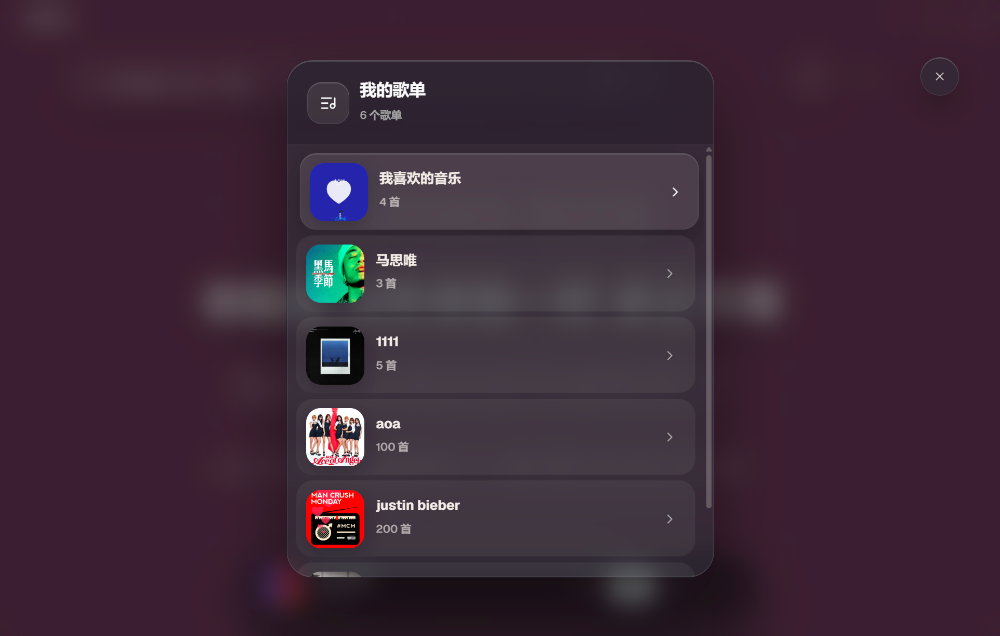
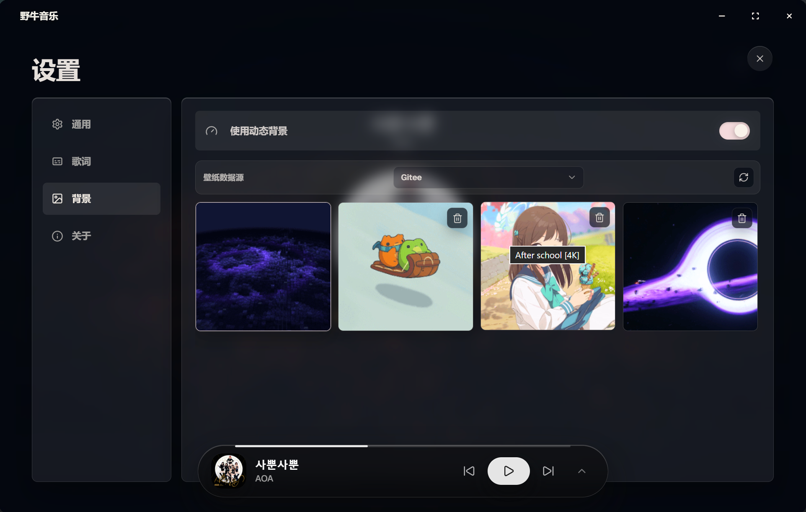

  <a href="./README.md">English</a> | <strong>简体中文</strong>

  
  <h1>野牛音乐</h1>
  
一款以歌词和沉浸体验为核心的桌面音乐播放器。

  

    
    
    
    
  

## 界面预览

| 居中歌词与精简控制栏 | 完整播放控制 |
| --- | --- |
|  |  |

| 背景设置 | 沉浸模式 |
| --- | --- |
|  |  |

| 我的歌单 | 动态背景与壁纸库 |
| --- | --- |
|  |  |

## 功能特性

- **音乐发现**：支持扫码登录、歌曲搜索、热门搜索和个人歌单。
- **完整播放体验**：支持播放队列、单曲循环、列表循环、随机播放、进度调节和音量控制。
- **动态歌词**：提供逐字歌词、单行或多行显示、翻译与罗马音，并可自定义字体、字号和颜色。
- **桌面歌词**：独立置顶歌词窗口，支持锁定、播放控制和外观设置。
- **沉浸界面**：以全屏歌词和专辑色彩营造专注的音乐体验。
- **动态背景**：根据专辑封面生成渐变背景，也可下载并使用图片、视频或网页壁纸。
- **桌面集成**：支持系统托盘、单实例运行、Windows 系统媒体控制与应用内更新。
- **键盘控制**：空格键播放或暂停，左右方向键快退或快进 5 秒，上下方向键调节音量。

## 下载

前往 [Releases](https://github.com/penkiKi/bison-player-releases/releases/latest) 下载最新的 Windows MSI 安装包。

## 技术栈

- [Tauri 2](https://v2.tauri.app/) / Rust
- [React 19](https://react.dev/) / TypeScript / Vite
- [Tailwind CSS 4](https://tailwindcss.com/)
- [Motion](https://motion.dev/) / [GSAP](https://gsap.com/)
- [Three.js](https://threejs.org/) / React Three Fiber
- [Apple Music-like Lyrics](https://github.com/Steve-xmh/applemusic-like-lyrics)

## 致谢

- 启动动画的 Three.js 场景与着色器参考并移植自 [ykob/sketch-threejs](https://github.com/ykob/sketch-threejs)，原项目采用 MIT License。
- 网易云音乐接口相关实现参考 [2061360308/NeteaseCloudMusic_PythonSDK](https://github.com/2061360308/NeteaseCloudMusic_PythonSDK)。
- QQ 音乐接口相关实现参考 [L-1124/QQMusicApi](https://github.com/L-1124/QQMusicApi)。
